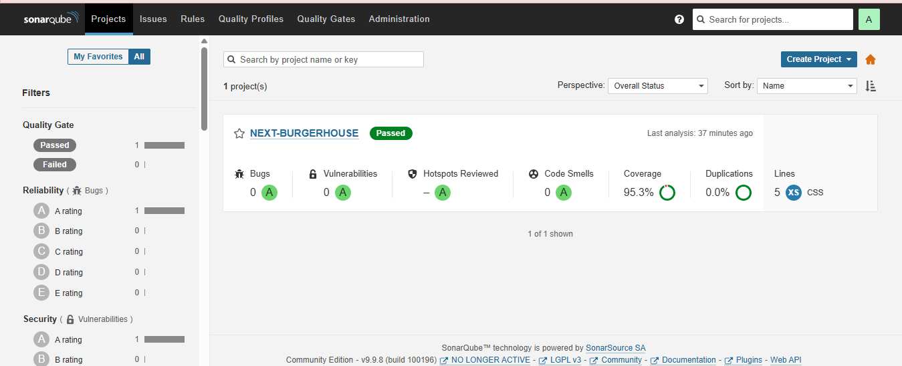
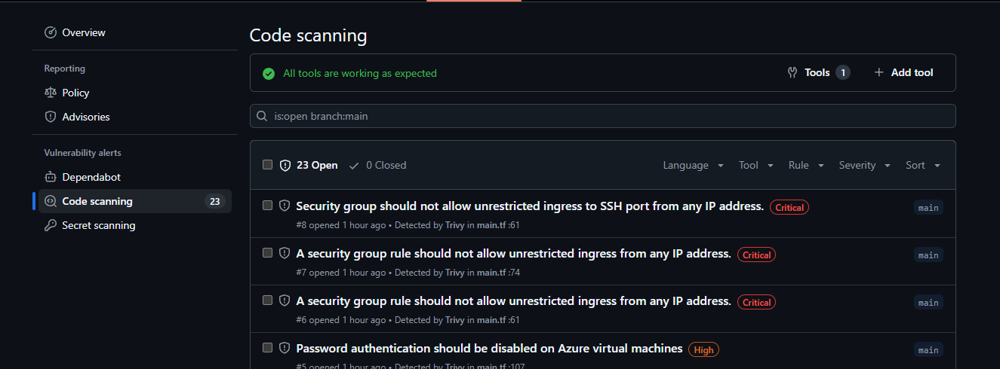

# Implementación de SonarQube + Trivy en Azure VM con Terraform

En este proyecto implementé un entorno completo para analizar la calidad y seguridad del código de mi aplicación **Next-BurgerHouse**, utilizando **SonarQube** y **Trivy** desplegados en una **máquina virtual de Azure** mediante **Terraform**, y automatizando todo el proceso con **GitHub Actions**.

---

## FASE 1: Configuración de Secrets en GitHub

Primero me autenticqué en Azure y obtuve mi *Subscription ID* para crear un **Service Principal**, lo que permitió que GitHub Actions pudiera conectarse y desplegar recursos automáticamente en Azure.
Con las credenciales generadas, configuré los **secrets** necesarios en mi repositorio de GitHub, incluyendo los accesos a Azure, el token de SonarQube y las variables para el despliegue.

---

## FASE 2: Creación de la Infraestructura con Terraform

Diseñé la infraestructura utilizando **Terraform**.
En la carpeta `infra/terraform` definí los archivos que crean una **máquina virtual Ubuntu** en Azure. Esta VM se encarga de instalar **Docker** y ejecutar **SonarQube** automáticamente en un contenedor, facilitando así su configuración y puesta en marcha.

---

## FASE 3: Automatización con GitHub Actions

Configuré dos workflows principales:

* Uno para desplegar la infraestructura en Azure cuando hay cambios en los archivos de Terraform.
* Otro para ejecutar las pruebas del proyecto, realizar el análisis de calidad con **SonarQube** y el escaneo de vulnerabilidades con **Trivy**.

De esta manera, se ejecuta de forma automatizada.

---

## FASE 4: Configuración del Proyecto

Ajusté la configuración de mi proyecto para integrarlo con SonarQube y los pipelines.
Modifiqué el archivo de propiedades de SonarQube, actualicé los scripts de pruebas en el `package.json`, y preparé un `Dockerfile` optimizado en dos etapas para mejorar la eficiencia en la construcción y despliegue de la aplicación.

---

## FASE 5: Despliegue y Verificación

Una vez ejecutado el workflow de infraestructura, obtuve la **IP pública** de la VM y accedí a la interfaz de **SonarQube**.
Desde allí generé un **token de análisis** y lo añadí como secreto en GitHub junto con la URL pública del servidor.

Finalmente, ejecuté el pipeline de análisis, verificando los resultados tanto en **SonarQube** como en **GitHub Security**, donde se visualizaron las alertas detectadas por **Trivy**.





---


# 🍔 Burger House

**Autores:**

* Leidy Daniela Londoño Candelo - A00392917
* Isabella Huila Cerón - A00394751

## 📌 Descripción del Proyecto

**Burger House** es una plataforma web desarrollada con el fin de mejorar la gestión de pedidos en un restaurante especializado en hamburguesas. El objetivo principal es ofrecer una experiencia de usuario fluida, reducir errores en la comunicación y mejorar los tiempos de atención al cliente.

Con esta aplicación, los clientes pueden explorar el menú, personalizar sus pedidos, realizar órdenes fácilmente y hacer seguimiento en tiempo real. Por su parte, los administradores pueden gestionar productos, toppings, usuarios y generar reportes.

---

## 🔐 Autenticación y Autorización

* Registro de nuevos usuarios.
* Inicio y cierre de sesión con credenciales.
* Pantalla diferenciada para login y registro.
* Acceso según el rol del usuario (cliente, administrador, delivery).

### 👤 Roles

* **Administrador:** Gestión de usuarios, productos, toppings y acceso a reportes.
* **Cliente:** Visualización del menú, gestión de carrito, creación de órdenes.
* **Delivery:** Solo visualiza las órdenes asignadas.

---

## 📦 Gestión del Menú

### 🧾 Productos

* Crear, editar y eliminar productos del menú (hamburguesas, bebidas, acompañamientos).
* Validaciones de campos en el cliente.
* Vista previa de imagen si la URL es válida.
* Manejo de errores por campo.

### 🧂 Toppings

* Crear, editar y eliminar toppings.
* Validaciones locales y control de errores globales.
* Vista previa e interacción fluida.

---

## 🛒 Carrito de Compras

* Disponible solo para clientes y administradores.
* Permite agregar productos y eliminar elementos del carrito.
* Si el carrito está vacío, no se muestra la interfaz.

---

## 📄 Reportes

Solo accesible para el usuario administrador:

* Generación de reportes en formato PDF: diario, semanal y mensual.
* Visualización previa del PDF antes de la descarga.

---

## 📋 Gestión de Órdenes

* Los clientes pueden realizar órdenes a partir del carrito.
* Posibilidad de añadir toppings y personalizar la orden.
* Ingreso de dirección para el domicilio.
* Confirmación de pago y visualización del resumen final.

---

## ✅ Validaciones

* Validaciones en formularios antes del envío.
* Mensajes de error visibles y claros por cada campo.
* Validación de imágenes mediante URL con vista previa.
* Control de errores integrados con Redux Toolkit.

---

## 🧪 Usuario de Prueba

Puedes iniciar sesión con el siguiente usuario administrador de prueba:

```
Correo: leidy@gmail.com  
Contraseña: 123Leidy
```

---

## 🛠️ Tecnologías Utilizadas

* **Next.js** (App cliente)
* **Redux Toolkit** (Gestión del estado)
* **Tailwind CSS** (Estilos)
* **PDF Generation** (Reportes)
* **Autenticación y manejo de roles**
